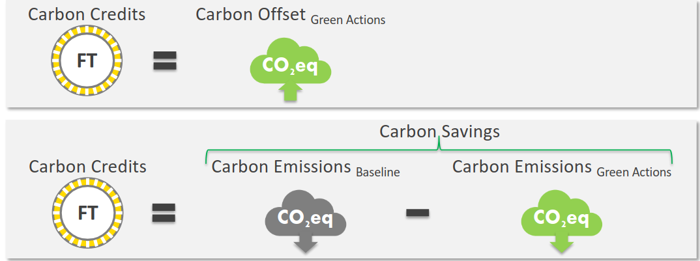
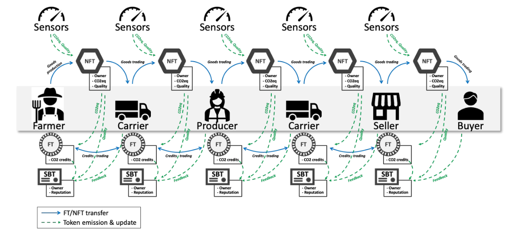

#  Settori della catena agroalimentare
Le aree coinvolte nella catena agroalimentare sono:
- Agricoltura
- Pesca
- Aziende di trasformazione
- Imballaggio
- Magazzino (Ingrosso)
- Trasporto
- Commercio al dettaglio
- Consumatori
- Servizi di ristorazione
- Smaltimento rifiuti

# CO2 equivalente
E' un'unità che misura l'impatto dei vari gas serra sul riscaldamento globale, esprimendoli come se fossero tutti CO2 fornendo una scala comune per misurare gli effetti sul clima causati da gas differenti. Espresso solitamente in kg o tonnellate di CO2.

# Carbon accounting ( Contabilità del carbone )
Sono una serie di metodologie che permettono di misurare e tenere traccia della quantità di gas serra emessa dalle organizzazioni.

# Tipi di meccanismi di carbon trading
1. **Carbon offsetting**: sono azioni compensative fatte dalle aziende nel caso in cui non possono effettuare azioni green. Un esempio di azioni compensative sono: investimenti in progetti green, piantare alberi ...etc
2. **Carbon saving**: in questo caso, le aziende rimpiazzano le attività/processi precendenti con azioni più sostenibili, riducendo la quantità di CO2 emessa dallo stesso processo. Un esempio può essere: l'uso di autobus elettrici al posto di autobus a metano/diesel.

Nel caso in cui un'azienda investe in uno dei meccanismi precedenti, verranno riconosciuti dei **Carbon Credits/Offset Credits** a seconda della quantità di CO2 equivalente ridotta, nel caso di Carbon Saving oppure compensata nel caso di Carbon Offsetting.
Il riconoscimento dei **Carbon Credits** è fatto dopo la verifica da parte di un ente governativo o indipendente.
Questi tipi di crediti sono **fungibili**, ovvero scambiabili fra le varie aziende

# Carbon credit economy (IMPORTANTE)

A seconda del risultato della formula del calcolo dei carbon credits (immagine precedente) si possono avere 2 casi:
1. **Risultato positivo**: vengono rilasciati nuovi crediti all'organizzazione.
2. **Risultato negativo**: vengono sottratti una certa quantità di crediti dal portafoglio (wallet) dell'organizzazione. Siccome i crediti sono fungibili, nel caso in cui l'organizzazione non dispone di crediti sufficienti, gli altri attori della stessa supply-chain, possono dargli i crediti necessari per coprire il debito.

L'obiettivo è avere un'emissione di CO2 equivalente minore del limite massimo stabilito per quel tipo di supply chain.

## Descrizione processo della supply chain agroalimentare

